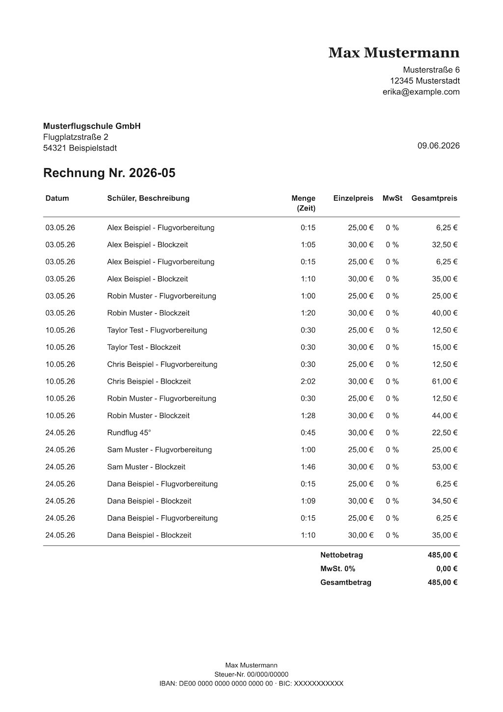

# Flight Instructor Tools

A Go CLI that automates monthly invoicing for my work as a flight instructor.

I built this to replace manual calculations and document preparation with a reproducible workflow. Session records and billing configuration serve as a single source of truth
for JSON snapshots, HTML invoices, and PDF documents.

## Features

- Calculates preparation and block-time charges.
- Applies billing rates based on their effective dates.
- Generates invoices for a given month from HTML templates, with PDF conversion through WeasyPrint.

<a href="invoice-screenshot.png">
    
</a>

## Getting Started

Requires Go 1.26.5 or newer and [WeasyPrint](https://doc.courtbouillon.org/weasyprint/stable/first_steps.html) available on `PATH`.

### Example

From the repository root, using the anonymized example data:

```sh
go run . generate \
    --input examples/realistic-sessions.json \
    --config examples/realistic-config.json \
    --month 2026-05 \
    --number 2026-05 \
    --issue-date 2026-06-09 \
    --signature /path/to/your/signature.png
```

Writes `Rechnung-2026-05.json`, `Rechnung-2026-05.html` and `Rechnung-2026-05.pdf` to `output/`.
See [examples](examples/) for input details and expected results. Keep private data in local/, which is ignored by Git.

### Usage

| Flag                      | Purpose                           | Default            |
| ------------------------- | --------------------------------- | ------------------ |
| `--input FILE`            | Sessions file (JSON)              | Required           |
| `--config FILE`           | Billing configuration file (JSON) | Required           |
| `--month YYYY-MM`         | Billing month                     | Required           |
| `--number NUMBER`         | Invoice number                    | Required           |
| `--issue-date YYYY-MM-DD` | Invoice date of issue             | Today (local time) |
| `--output-dir DIR`        | Output directory                  | `output/`          |
| `--signature FILE`        | PNG signature file                | `signature.png`    |

### Tests

```sh
go test .
```

## Limitations

Currently this is tailored to my own workflow: EUR invoices, German formatting, and 0% VAT. Matching activities are combined within a session, but not across sessions. Review generated invoices before sending them.

## License

Licensed under the [MIT License](LICENSE).
